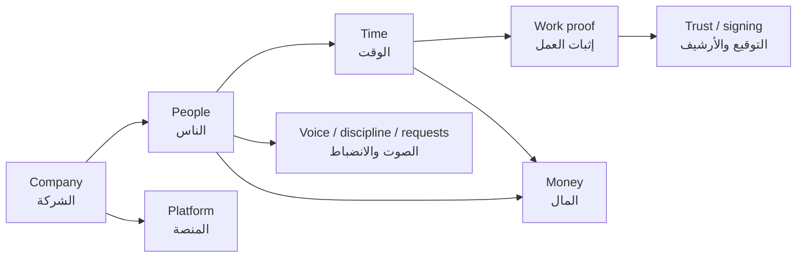

# NiroVera / PowerCare — programmer schema entry

**Open this file first.** Machine catalog: [`data/domains.jsonc`](data/domains.jsonc). Doctor: `node scripts/test-data-catalog.mjs`.
`DATA.md` and `entities/_schema.md` are pointers here — not a second map.

**Proof Cycle (never break):** attendance → task → review → escalation → sign/stamp → client proof.
Figures are derived. Do not move ministry numbers into stored columns. Do not rename a live key without a preview migration.
Stored person key is `employeeId` (also `Employee.id` in the local cache). Loop variables named `empId` are not a second identifier.

## How to add an entity

1. Create base44/entities/Name.jsonc. Tenant rows must declare companyId in properties (unless the isolation map marks the entity platform / none).
2. Add exactly one collection under the matching domain in base44/data/domains.jsonc. One key, one record. List owner function, identity, isolationKey if it is not companyId.
3. If the fact is a CompanyDataBlob category: add the category to domains.jsonc, then to src/lib/store.js BLOB_CATEGORIES and base44/shared/blobVisibility.ts. Undeclared visibility = hidden.
4. If the fact already lives on another key, do not add a second write path. Mark the extra key legacy / do-not-write and point splitOf at the canonical key.
5. Run: node scripts/test-data-catalog.mjs --fix   then   node scripts/test-data-catalog.mjs

## Isolation rule

- **Tenant:** Every tenant fact is keyed by companyId. Missing companyId on write is a cross-tenant leak.
- **Person:** Stored person key is employeeId (also Employee.id in the local cache). Loop variables named empId are not a second identifier.
- **Platform exceptions:** User, SubscriptionPlan, PageVisit, UiTranslation have no companyId by design. SubscriptionPayment.companyId is nullable (checkout before a company exists). SignedDocument.companyId is optional (public-verify rows).
- **Preview-only rows:** permissionTemplates, signingFieldTemplates, stationChatGroups isolate via the company localStorage key, not a row-level companyId.
- **Nested:** leaveRequests and otherRequests isolate via the parent Employee.companyId. Do not invent a first-class table for them.
- **Never leak:** Never embed employee names, salaries, or complaint sender identity on a public / cross-tenant row (ClientProof, AnonymousReport, PageVisit).

## Domain map

Domains first — not forty tables in one hairball.

- **Company — الشركة** — Tenant envelope, session, blob store. Isolation starts here. `CompanyAccount`, `CompanySession`, `LoginOtp`, `CompanyDataBlob`, `companyMeta`, `companySettings`, `SyncSignal`, `AuditLog`
- **People — الناس** — Employee, contract, org seat, hire, offboard. Person ref for every later domain. `employees`, `EmployeeCredential`, `User`, `stations`, `orgSeats`, `orgTree`, `orgStructure`, `orgStructureLog`, `smartPositions`, `permissionTemplates`, `hrLevels`, `hrClusters`, `jobGrades`, `hcmFoundation`, `hcmPerformance`, `hiringPipeline`, `offboardingCustody`, `employeeCompliance`, `leaveRequests`, `otherRequests`
- **Time — الوقت** — Proof Cycle step 1 — person + place + time. Feeds payroll and tasks. `personalAttendance`, `attendanceLedger`, `personalPlaces`, `schedules`, `publishedRotas`, `leaveRoster`, `attendancePolicy`, `attendanceEmergency`
- **Work proof — إثبات العمل** — Proof Cycle steps 2–4 and 6 — task, review, escalation, client proof. Not signing. `tasks`, `operationsTasks`, `workProofs`, `WorkProof`, `visitorProofs`, `ClientProof`, `PointsLedger`, `targets`, `plans`, `safety`, `hseCredits`, `competencyCerts`
- **Trust / signing — التوقيع والأرشيف** — Proof Cycle step 5 — Secure Sign. Own domain, not WorkProof. `signatureRequests`, `SignedDocument`, `signingFieldTemplates`, `signingChain`, `files`, `smartArchive`, `NiroDocumentReview`
- **Money — المال** — Payroll, expenses, assets, inventory. Figures from derivations only. `payrollRuns`, `journalEntries`, `expenseClaims`, `stationBudgets`, `expenseBudget`, `assets`, `assetCustody`, `assetMaintenance`, `assetTransfers`, `inventoryItems`, `InventoryUnit`, `materialRequests`, `stockMovements`, `stockBoard`, `ProcurementRequest`, `PurchaseOrder`
- **Voice / discipline / requests — الصوت والانضباط** — Anonymous voice, complaints, discipline, daily reports. `anonymousReports`, `publicReports`, `complaintQueue`, `AnonymousReportReceipt`, `complaintEscalationChain`, `branchEscalationChains`, `disciplinaryCases`, `laborRules`, `arbitrationOutcomes`, `reports`, `reportAnalytics`, `dailyReports`
- **Platform — المنصة** — SaaS chrome: plans, billing, visits, translations, chat, assistant. Not the Proof Cycle. `SubscriptionPlan`, `SubscriptionPayment`, `PageVisit`, `UiTranslation`, `ProductFeedback`, `notifications`, `templates`, `plannerItems`, `assistantFacts`, `stationChatGroups`, `stationChat`, `cameras`

## Problems board

The messy left side, labeled. A programmer should see the red flag here without grepping the repo.
Canonical = write here. `legacy` / `do-not-write` = second silo still in the tree; do not pretend a migration already landed.

| id | severity | canonical | legacy / extra | evidence | what you will see |
| --- | --- | --- | --- | --- | --- |
| **split-tasks** | risky | `tasks` | `operationsTasks` | `src/lib/store.js:764` `base44/functions/operations/entry.ts:45` `base44/functions/hcm/entry.ts:32` `base44/functions/scores/entry.ts:14` `base44/functions/dailyReport/entry.ts:22` | Writes go to tasks. operationsTasks is read-once fallback then persist canonical. Do not dual-write. |
| **split-files** | risky | `files` | `smartArchive` | `src/lib/store.js:764` `base44/functions/files/entry.ts:19` | Writes go to files. smartArchive is read-once fallback. files function is do-not-invoke-from-frontend. |
| **split-reports** | risky | `reports` | `reportAnalytics`, `dailyReports` | `src/lib/store.js:764` `base44/functions/dailyReport/entry.ts:20` `base44/functions/dailyReport/entry.ts:21` `base44/functions/reports/entry.ts:19` | Writes go to reports. dailyReports is read-once fallback. reportAnalytics writes are stopped (orphaned analytics shape — do not merge onto the reports array). |
| **split-complaints** | risky | `anonymousReports` | `complaintQueue` | `src/lib/store.js:764` `base44/functions/complaints/entry.ts:21` | Writes go to anonymousReports (array). complaintQueue is read-once fallback. |
| **split-workproof-shape** | risky | `workProofs` | `WorkProof` | `base44/functions/workproof/entry.ts:22` `src/pages/WorkProof.jsx:75` `base44/entities/WorkProof.jsonc` | Live data is the workProofs blob (ref, sealId). WorkProof entity still requires proofNumber/workTitle — a second shape, not the runtime store. No entities.WorkProof reader in functions or src/. Do-not-write the entity. |
| **split-attendance** | risky | `personalAttendance` | `attendanceLedger` | `src/lib/store.js:767` `base44/functions/attendance/entry.ts:16` | Writes go to personalAttendance. attendanceLedger is read-once fallback. attendance function is do-not-invoke-from-frontend. |
| **split-org** | risky | `orgTree` | `orgStructure` | `src/lib/store.js:768` `base44/functions/org/entry.ts:26` | Writes go to orgTree (node array) plus companyMeta.orgBoard extras. orgStructure is read-once fallback. |
| **split-budget** | risky | `stationBudgets` | `expenseBudget` | `src/lib/store.js:480` `base44/functions/budget/entry.ts:15` | Writes go to stationBudgets. expenseBudget is read-once fallback. Claims persist on ExpenseClaim. |
| **split-stock** | risky | `inventoryItems` | `stockBoard` | `src/lib/store.js:480` `base44/functions/stock/entry.ts:15` | stockBoard writes are stopped. Live preview quantity is inventoryItems via inventoryApi. stock function is do-not-invoke-from-frontend. |
| **split-signing** | risky | `signatureRequests` | `signingChain` | `src/pages/FileSigning.jsx:75` `base44/functions/signing/entry.ts:17` | signingChain writes are stopped. Live envelopes are SignatureRequest via multiSign. signing function is do-not-invoke-from-frontend. |
| **split-settings** | risky | `companyMeta` | `companySettings` | `src/lib/store.js:690` `base44/functions/settings/entry.ts:17` | Writes go to companyMeta. companySettings is read-once fallback. |
| **signed-doc-companyId** | risky | `SignedDocument` | — | `base44/entities/SignedDocument.jsonc:23` `base44/entities/SignedDocument.jsonc:40` | SignedDocument.companyId is optional (not in required). Making it required would break public-verify rows created without a tenant. Do not flip required without a backfill. |
| **orphan-function-silos** | risky | — | — | `src/pages/WorkProof.jsx:75` `src/lib/inventoryApi.js:55` | Frontend never invokes attendance, files, stock, signing, reports, dailyReport, chat, or inventory. Folders kept; new writes to parallel keys are stopped. A leftover call must use the owner of the canonical bag. |
| **inventory-forced-local** | risky | `inventoryItems` | — | `src/lib/inventoryApi.js:55` `src/pages/Inventory.jsx:5` | inventoryApi.js calls forceLocalInventory on every request. The inventory function (ProcurementRequest, PurchaseOrder, InventoryUnit) is dark from the UI. Preview store is the live path. |
| **inventory-qty-dual** | risky | `inventoryItems` | `InventoryUnit` | `src/lib/localInventoryFallback.js:58` `base44/functions/inventory/entry.ts:305` `base44/entities/InventoryItem.jsonc` | Preview quantity is InventoryItem.locationBalances + quantity. Cloud inventory also writes InventoryUnit rows. Two quantity truths for the same SKU. |
| **arbitration-preview-gap** | fixed | `arbitrationOutcomes` | — | `src/components/hr/ArbitrationEngineBoard.jsx:64` `src/lib/store.js` `src/lib/store.js` `base44/functions/compliance/entry.ts:26` | arbitrationOutcomes is in COMPANY_ARRAY_KEYS and BLOB_CATEGORIES. listArbitrationOutcomes reads the store bag. |
| **preview-blob-gaps** | info | — | — | `src/lib/store.js:764` `base44/data/domains.jsonc previewGaps.notInStoreBlobCategories` | These CompanyDataBlob categories are owned by functions but are not in store.js BLOB_CATEGORIES. companyDirectory preview sync will not push/pull them. Listed in previewGaps — do not add a second undocumented category. |
| **workproof-folder-case** | fixed-visible | `workProofs` | — | `src/pages/WorkProof.jsx:75` `base44/functions/workproof/entry.ts` `base44/functions/workProof/entry.ts` | Frontend invokes workproof. A workProof folder listing also exists; on Windows they are the same path. Canonical invoke name: workproof. |
| **workproof-signToken** | fixed | `signatureRequests` | — | `base44/entities/SignatureRequest.jsonc` | signToken is not on the WorkProof entity or the workProofs blob. Tokens belong to SignatureRequest / nested otherRequests. |
| **hydrate-otherRequests** | fixed | `otherRequests` | — | `src/lib/store.js` | hydrateEmployeesFromEntity used to drop otherRequests (study_consent, overtime, written consent). Cloud rows survived; the preview cache after hydrate lost the inbox. |

## Domains (one job per collection)

### People / org — الناس والتنظيم

Employee, station, contract seat, hire, offboard. Person ref for every later domain.

| key | status | purpose | isolation | relates | never denorm / leak | how a bug looks |
| --- | --- | --- | --- | --- | --- | --- |
| `employees` | canonical | Person record. Session userId is employeeId (also stored as Employee.employeeId). | companyId | stationId → Station; employeeId → EmployeeCredential | Do not store payroll totals, ministry figures, or leave balances as source columns — derive them. | Missing companyId = person appears in another tenant. |
| `EmployeeCredential` | canonical | Password hash only. Never localStorage. | companyId | employeeId → Employee | Never copy passwordHash into a blob or preview row. | Orphan employeeId = login works, profile missing. |
| `User` | platform | Base44 platform user (admin/user). Not a tenant employee. | none | — | Do not add companyId here; it is platform-scoped. | Treating User.id as employeeId mixes platform admins into the roster. |
| `stations` | canonical | Workplace / org node. Check-in GPS and hire seat live here. | companyId | managerId → Employee; parentStationId → Station | Do not rename stationId without previewMigrations + every reader. | Missing companyId = workplace leaks across tenants. Orphan parentStationId = broken org tree. |
| `orgSeats` | canonical | Org chart seat bound to one employee. | companyId | employeeId → Employee | Permissions are on smartPositions / templates, not copied onto the seat as figures. | Orphan employeeId = empty seat that still blocks a hire. |
| `orgTree` | canonical | Serialized org graph (nodes + edges) for the people tree. | companyId | node.refId → Employee or Station | Prefer orgTree over orgStructure. | orgStructure split = tree drawn from the empty silo. |
| `orgStructure` | legacy-read-fallback | Split silo of orgTree. Prefer the canonical key. | companyId | splitOf orgTree | Figures come from orgDerivations.ts — do not store them as source columns. | Writes go to orgTree (node array) plus companyMeta.orgBoard extras. orgStructure is read-once fallback. |
| `orgStructureLog` | canonical | Synced inside companyMeta, not its own blob category. | companyId | — | Figures come from orgDerivations.ts — do not store them as source columns. | Missing companyId on write = cross-tenant leak. |
| `smartPositions` | canonical | CompanyDataBlob category "smartPositions". | companyId | employeeId → Employee.employeeId | Figures come from orgDerivations.ts — do not store them as source columns. | Missing companyId on write = cross-tenant leak. |
| `permissionTemplates` | preview-only | Reusable permission packs. Local preview only — not in BLOB_CATEGORIES. | none | applied onto smartPositions.employeeId → Employee | Do not copy a template onto every employee as frozen figures. | Row has no companyId — isolation is the company localStorage key, not the row. |
| `hrLevels` | canonical | CompanyDataBlob category "hrLevels". | companyId | — | Figures come from hcmDerivations.ts — do not store them as source columns. | Missing companyId on write = cross-tenant leak. |
| `hrClusters` | canonical | CompanyDataBlob category "hrClusters". | companyId | — | Figures come from hcmDerivations.ts — do not store them as source columns. | Missing companyId on write = cross-tenant leak. |
| `jobGrades` | canonical | CompanyDataBlob category "jobGrades". | companyId | — | Figures come from hcmDerivations.ts — do not store them as source columns. | Missing companyId on write = cross-tenant leak. |
| `hcmFoundation` | canonical | CompanyDataBlob category "hcmFoundation". | companyId | — | Figures come from hcmDerivations.ts — do not store them as source columns. | Missing companyId on write = cross-tenant leak. |
| `hcmPerformance` | canonical | CompanyDataBlob category "hcmPerformance". | companyId | employeeId → Employee.employeeId | Figures come from perfDerivations.ts — do not store them as source columns. | Missing companyId on write = cross-tenant leak. |
| `hiringPipeline` | canonical | CompanyDataBlob category "hiringPipeline". | companyId | — | Figures come from hiringDerivations.ts — do not store them as source columns. | Missing companyId on write = cross-tenant leak. |
| `offboardingCustody` | canonical | CompanyDataBlob category "offboardingCustody". | companyId | employeeId → Employee.employeeId | Figures come from offboardingDerivations.ts — do not store them as source columns. | Missing companyId on write = cross-tenant leak. |
| `employeeCompliance` | canonical | CompanyDataBlob category "employeeCompliance". | companyId | employeeId → Employee.employeeId | Figures come from complianceDerivations.ts — do not store them as source columns. | Missing companyId on write = cross-tenant leak. |

### Attendance / hours / shifts — الحضور والورديات

Proof Cycle step 1 — person + place + time. Feeds payroll and tasks.

| key | status | purpose | isolation | relates | never denorm / leak | how a bug looks |
| --- | --- | --- | --- | --- | --- | --- |
| `personalAttendance` | canonical | Daily punch / presence. Proof Cycle step 1. | companyId | employeeId → Employee; stationId → Station | Hours and OT pay are derived — do not store ministry totals on the row. | Missing companyId = attendance of tenant A shown to tenant B. Missing dateKey = payroll miss. |
| `attendanceLedger` | legacy-read-fallback | Split silo of personalAttendance (attendance function). | companyId | splitOf personalAttendance | Prefer personalAttendance as the live key. | Writes here, reads there = silent empty day. |
| `personalPlaces` | canonical | CompanyDataBlob category "personalPlaces". | companyId | employeeId → Employee.employeeId | Figures come from attendanceDerivations.ts — do not store them as source columns. | Missing companyId on write = cross-tenant leak. |
| `schedules` | canonical | Shift types and week assignments per station. | companyId | stationId → Station; assignment employee ids → Employee | Do not store computed week hours as source columns. | Orphan stationId = rota board for a deleted workplace. |
| `publishedRotas` | canonical | CompanyDataBlob category "publishedRotas". | companyId | stationId → Station | Figures come from shiftDerivations.ts — do not store them as source columns. | Missing companyId on write = cross-tenant leak. |
| `attendancePolicy` | canonical | CompanyDataBlob category "attendancePolicy". | companyId | — | Figures come from attendanceDerivations.ts — do not store them as source columns. | Missing companyId on write = cross-tenant leak. |
| `attendanceEmergency` | canonical | CompanyDataBlob category "attendanceEmergency". | companyId | — | Figures come from attendanceDerivations.ts — do not store them as source columns. | Missing companyId on write = cross-tenant leak. |

### Leave / requests — الإجازات والطلبات

Leave inbox, study_consent, leave top-up, overtime assignment, written consent. Nested on Employee — not a first-class table.

| key | status | purpose | isolation | relates | never denorm / leak | how a bug looks |
| --- | --- | --- | --- | --- | --- | --- |
| `leaveRequests` | canonical | Annual / sick / other leave rows nested on employees[]. | companyId | employeeId → Employee; cloud snapshot → leaveRoster | Do not edit chargeable days on leaveRoster — derive from leaveDerivations. | Row on a missing employee = inbox vanishes. Missing companyId on the parent employee = cross-tenant leak. |
| `otherRequests` | canonical | study_consent, leave top-up, overtime assignment, written consent. Nested on employees[]. | companyId | employeeId → Employee; signing token → SignatureRequest (not WorkProof) | Do not put signToken on workProofs. Tokens belong here or on SignatureRequest. | Dropped on hydrate = study/OT inbox empty after cloud pull. |
| `leaveRoster` | canonical | Derived snapshot of employees[].leaveRequests for scope readers. | companyId | employeeId → Employee | Do not treat this blob as the source of leave days. | Editing figures here while employees[].leaveRequests differ = two truths. |

### Money — المال

Payroll, expenses, assets, inventory. Figures from derivations only.

| key | status | purpose | isolation | relates | never denorm / leak | how a bug looks |
| --- | --- | --- | --- | --- | --- | --- |
| `payrollRuns` | canonical | Payroll cycle snapshot. Amounts are derived at run time. | companyId | line employee ids → Employee | Do not persist ministry/WPS figures as editable columns. | Hard-coded net pay on the screen while the run blob differs. |
| `journalEntries` | canonical | Employee self-service journal / memo lines. | companyId | userId → Employee.employeeId | Not a payroll journal. Do not store net pay here. | Missing companyId = another tenant reads private notes. |
| `expenseClaims` | canonical | Expense claim with receipt and approval chain. | companyId | requesterId → Employee; stationId → Station | Do not store remaining budget on the claim — derive from station vessel. | Missing companyId = claim paid from another tenant. amount vs afterTaxAmount drift. |
| `stationBudgets` | canonical | Station expense vessel. Canonical blob + store array. | companyId | stationId → Station | Remaining SAR is derived — do not persist it as the source. | Writes to expenseBudget while the board reads stationBudgets = empty vessel. |
| `expenseBudget` | legacy-read-fallback | Split silo of stationBudgets. Prefer the canonical key. | companyId | splitOf stationBudgets | Figures come from expenseDerivations.ts — do not store them as source columns. | Writes go to stationBudgets. expenseBudget is read-once fallback. Claims persist on ExpenseClaim. |
| `assets` | canonical | Physical asset with QR and current custodian. | companyId | holderId → Employee; stationId / purchasedByStationId → Station | Book cost stays on the buying station after transfer. | Empty holderId = asset with no custodian (unit custodian must hold available assets). |
| `assetCustody` | canonical | AssetCustody tenant row. | companyId | toId → Employee.employeeId | Do not copy tenant rows across companyId. Employee identities, salaries, attendance, proofs, complaints, and chat stay inside the tenant. | Missing companyId on write = cross-tenant leak. |
| `assetMaintenance` | canonical | AssetMaintenance tenant row. | companyId | — | Do not copy tenant rows across companyId. Employee identities, salaries, attendance, proofs, complaints, and chat stay inside the tenant. | Missing companyId on write = cross-tenant leak. |
| `assetTransfers` | canonical | CompanyDataBlob category "assetTransfers". | companyId | — | Do not copy tenant rows across companyId. Employee identities, salaries, attendance, proofs, complaints, and chat stay inside the tenant. | Missing companyId on write = cross-tenant leak. |
| `inventoryItems` | canonical | Stock SKU. Live quantity is locationBalances + currentLocationId. | companyId | companyId; InventoryUnit.itemId → this id | Do not also treat stockBoard as source quantity. | quantity vs locationBalances disagree = phantom stock. |
| `InventoryUnit` | canonical | Cloud per-location quantity. Frontend inventoryApi.js force-locals to InventoryItem.locationBalances — two quantity truths. Do not treat this as the preview source. | companyId | — | Figures come from inventoryDerivations.ts — do not store them as source columns. | Preview quantity is InventoryItem.locationBalances + quantity. Cloud inventory also writes InventoryUnit rows. Two quantity truths for the same SKU. |
| `materialRequests` | canonical | MaterialRequest tenant row. | companyId | requesterId → Employee.employeeId | Figures come from inventoryDerivations.ts — do not store them as source columns. | Missing companyId on write = cross-tenant leak. |
| `stockMovements` | canonical | StockMovement tenant row. | companyId | performedBy → Employee.employeeId | Figures come from inventoryDerivations.ts — do not store them as source columns. | Missing companyId on write = cross-tenant leak. |
| `stockBoard` | retired | Split silo of inventoryItems. Prefer the canonical key. | companyId | splitOf inventoryItems | Figures come from inventoryDerivations.ts — do not store them as source columns. | stockBoard writes are stopped. Live preview quantity is inventoryItems via inventoryApi. stock function is do-not-invoke-from-frontend. |
| `ProcurementRequest` | canonical | ProcurementRequest tenant row. | companyId | — | Figures come from inventoryDerivations.ts — do not store them as source columns. | Missing companyId on write = cross-tenant leak. |
| `PurchaseOrder` | canonical | PurchaseOrder tenant row. | companyId | — | Figures come from inventoryDerivations.ts — do not store them as source columns. | Missing companyId on write = cross-tenant leak. |

### Proof cycle — دورة الإثبات

Steps 2–4 and 6 — task → review → escalation → client proof. Signing is step 5 but lives under Trust so it is not recoupled to WorkProof.

| key | status | purpose | isolation | relates | never denorm / leak | how a bug looks |
| --- | --- | --- | --- | --- | --- | --- |
| `tasks` | canonical | Operational task — effort, field gate, evidence, attestation. Proof Cycle step 2. | companyId | assignedTo / ownerId → Employee; stationId → Station | Review reason and escalation live on the task trail — do not invent a second task table for UI. | operationsTasks split = approve in one silo, list in the other. |
| `operationsTasks` | legacy-read-fallback | Split silo of tasks (operations/hcm/scores/dailyReport). | companyId | splitOf tasks | Same fact as tasks. Do not write a third copy. | Two Proof Cycle step-2 bags — a bug hides in the gap. |
| `workProofs` | canonical | Live work-proof blob. Shape uses ref / sealId. | companyId | raiserId → Employee; task via ref | Do not add signToken. Client-facing disclose fields belong on ClientProof. | Writing WorkProof.proofNumber here = row the UI never finds. |
| `WorkProof` | unused | Typed table exists but is NOT the runtime store. Live data is the workProofs blob. | companyId | performedById → Employee (unused path) | Do not recouple signing or task review onto this entity. | Creating a WorkProof entity row while the app reads workProofs = invisible proof. |
| `visitorProofs` | canonical | CompanyDataBlob category "visitorProofs". | companyId | — | Figures come from workProofDerivations.ts — do not store them as source columns. | Missing companyId on write = cross-tenant leak. |
| `ClientProof` | canonical | Public verify payload — allowed fields + content hash only. | companyId | companyId + stationId; no employee identities | Never embed employee names, ids, or salaries. | Employee identity in snapshot = trust leak on the public link. |
| `PointsLedger` | canonical | PointsLedger tenant row. | companyId | employeeId → Employee.employeeId | Figures come from perfDerivations.ts — do not store them as source columns. | Missing companyId on write = cross-tenant leak. |
| `targets` | canonical | CompanyDataBlob category "targets". | companyId | assignedTo → Employee.employeeId | Figures come from opsDerivations.ts — do not store them as source columns. | Missing companyId on write = cross-tenant leak. |
| `plans` | canonical | CompanyDataBlob category "plans". | companyId | — | Figures come from opsDerivations.ts — do not store them as source columns. | Missing companyId on write = cross-tenant leak. |
| `safety` | canonical | CompanyDataBlob category "safety". | companyId | stationId → Station | Figures come from hseDerivations.ts — do not store them as source columns. | Missing companyId on write = cross-tenant leak. |
| `hseCredits` | canonical | CompanyDataBlob category "hseCredits". | companyId | employeeId → Employee.employeeId | Figures come from hseDerivations.ts — do not store them as source columns. | Missing companyId on write = cross-tenant leak. |
| `competencyCerts` | canonical | CompanyDataBlob category "competencyCerts". | companyId | employeeId → Employee.employeeId | Figures come from opsDerivations.ts — do not store them as source columns. | Missing companyId on write = cross-tenant leak. |

### Trust / files / chat / discipline — الثقة والملفات والدردشة والانضباط

Proof Cycle step 5 (Secure Sign) plus archive, station chat, and disciplinary cases.

| key | status | purpose | isolation | relates | never denorm / leak | how a bug looks |
| --- | --- | --- | --- | --- | --- | --- |
| `signatureRequests` | canonical | Secure Sign request. Proof Cycle step 5. | companyId | creatorId → Employee; signers[].token is the public link half | Do not put signToken on WorkProof or tasks. | Missing companyId = another tenant can list the envelope. sequential on old rows is ignored. |
| `SignedDocument` | canonical | Public verification badge (PWC-…) bound to fileHash. | companyId | signerId → Employee (optional); companyId optional by design | Do not flip companyId to required without a backfill of public-verify rows. | Missing companyId on an in-app row = weaker isolation; expected on some public-verify rows. |
| `signingFieldTemplates` | preview-only | Local cache key "signingFieldTemplates". | none | — | Figures come from signingDerivations.ts — do not store them as source columns. | No companyId — confirm this is platform-wide, not a tenant leak. |
| `signingChain` | retired | Split silo of signatureRequests. Prefer the canonical key. | companyId | splitOf signatureRequests | Figures come from signingDerivations.ts — do not store them as source columns. | signingChain writes are stopped. Live envelopes are SignatureRequest via multiSign. signing function is do-not-invoke-from-frontend. |
| `files` | canonical | Company file archive. | companyId | uploadedBy → Employee | Prefer this key over smartArchive. | smartArchive split = upload here, list there. |
| `smartArchive` | legacy-read-fallback | Split silo of files. Prefer the canonical key. | companyId | splitOf files | Figures come from fileArchiveDerivations.ts — do not store them as source columns. | Writes go to files. smartArchive is read-once fallback. files function is do-not-invoke-from-frontend. |
| `NiroDocumentReview` | canonical | NiroDocumentReview tenant row. | companyId | actorId → Employee.employeeId | Figures come from assistantDerivations.ts — do not store them as source columns. | Missing companyId on write = cross-tenant leak. |
| `disciplinaryCases` | canonical | CompanyDataBlob category "disciplinaryCases". | companyId | employeeId → Employee.employeeId | Figures come from disciplineDerivations.ts — do not store them as source columns. | Missing companyId on write = cross-tenant leak. |
| `laborRules` | catalog | Read-only labour_rules catalog (Labour Law + 18632 + 3337). Never a company-editable table. | none | Cited by named gates and arbitration verdicts | Do not copy rule values onto screens or tenant rows — read ruleAt/ruleValue. | A second rules table per company would invent verses. |
| `arbitrationOutcomes` | canonical | Append-only preliminary arbitration verdicts. The system is the actor. | companyId | employeeId → Employee; requestId → leaveRequests/otherRequests | Never update or delete a sealed row. Score is derived from live gates, not stored. | Editing a sealed verdict breaks the immutable audit trail. |
| `stationChatGroups` | preview-only | Cached on companyMeta. Live messages: stationChat blob. | none | — | Figures come from chatDerivations.ts — do not store them as source columns. | No companyId — confirm this is platform-wide, not a tenant leak. |
| `stationChat` | canonical | CompanyDataBlob category "stationChat". | companyId | senderId → Employee.employeeId | Figures come from chatDerivations.ts — do not store them as source columns. | Missing companyId on write = cross-tenant leak. |

### Company (tenant envelope) — الشركة

Tenant envelope, session, blob store. Isolation starts here.

| key | status | purpose | isolation | relates | never denorm / leak | how a bug looks |
| --- | --- | --- | --- | --- | --- | --- |
| `CompanyAccount` | canonical | Tenant registry. ownerPassword is server-side only. | companyId | companyId is the tenant key | Never put ownerPassword in localStorage or a blob. | Missing companyId = orphan account that login cannot find. |
| `CompanySession` | canonical | Session tokens. Browser cache: powercare_tokens / powercare_session. | companyId | — | Do not copy tenant rows across companyId. Employee identities, salaries, attendance, proofs, complaints, and chat stay inside the tenant. | Missing companyId on write = cross-tenant leak. |
| `LoginOtp` | canonical | LoginOtp tenant row. | companyId | email → Employee.employeeId | Do not copy tenant rows across companyId. Employee identities, salaries, attendance, proofs, complaints, and chat stay inside the tenant. | Missing companyId on write = cross-tenant leak. |
| `CompanyDataBlob` | canonical | Envelope for every blob category. One row per (companyId, category). | companyId | category → catalog blob key | Do not invent a category that is not in this catalog. | Unknown category = data that the doctor and ACL cannot see. |
| `companyMeta` | canonical | Name, plan, director, settings, stationChatGroups, orgStructureLog. | companyId | directorId → Employee.employeeId | Figures come from settingsDerivations.ts — do not store them as source columns. | Missing companyId on write = cross-tenant leak. |
| `companySettings` | legacy-read-fallback | Split silo of companyMeta. Prefer the canonical key. | companyId | splitOf companyMeta | Figures come from settingsDerivations.ts — do not store them as source columns. | Writes go to companyMeta. companySettings is read-once fallback. |
| `SyncSignal` | canonical | SyncSignal tenant row. | companyId | — | Do not copy tenant rows across companyId. Employee identities, salaries, attendance, proofs, complaints, and chat stay inside the tenant. | Missing companyId on write = cross-tenant leak. |
| `AuditLog` | canonical | AuditLog tenant row. | companyId | performedBy → Employee.employeeId | Do not copy tenant rows across companyId. Employee identities, salaries, attendance, proofs, complaints, and chat stay inside the tenant. | Missing companyId on write = cross-tenant leak. |

### Voice / complaints — الصوت والشكاوى

Anonymous and public reports. Discipline lives under Trust.

| key | status | purpose | isolation | relates | never denorm / leak | how a bug looks |
| --- | --- | --- | --- | --- | --- | --- |
| `anonymousReports` | canonical | Anonymous voice inbox. Append-only; archive with reason. | companyId | receipt via AnonymousReportReceipt.employeeId (private) | Never store the sender name on the report row. | complaintQueue split = handler sees a different list than store. |
| `publicReports` | canonical | CompanyDataBlob category "publicReports". | companyId | — | Figures come from complaintDerivations.ts — do not store them as source columns. | Missing companyId on write = cross-tenant leak. |
| `complaintQueue` | legacy-read-fallback | Split silo of anonymousReports. Prefer the canonical key. | companyId | splitOf anonymousReports | Figures come from complaintDerivations.ts — do not store them as source columns. | Writes go to anonymousReports (array). complaintQueue is read-once fallback. |
| `AnonymousReportReceipt` | canonical | AnonymousReportReceipt tenant row. | companyId | employeeId → Employee.employeeId | Figures come from complaintDerivations.ts — do not store them as source columns. | Missing companyId on write = cross-tenant leak. |
| `complaintEscalationChain` | canonical | CompanyDataBlob category "complaintEscalationChain". | companyId | — | Figures come from complaintDerivations.ts — do not store them as source columns. | Missing companyId on write = cross-tenant leak. |
| `branchEscalationChains` | canonical | Store treats this as an object map, not an array. | companyId | — | Figures come from complaintDerivations.ts — do not store them as source columns. | Missing companyId on write = cross-tenant leak. |
| `reports` | canonical | CompanyDataBlob category "reports". | companyId | createdBy → Employee.employeeId | Figures come from dailyReportDerivations.ts — do not store them as source columns. | Missing companyId on write = cross-tenant leak. |
| `reportAnalytics` | retired | Split silo of reports. Prefer the canonical key. | companyId | splitOf reports | Figures come from reportsDerivations.ts — do not store them as source columns. | Writes go to reports. dailyReports is read-once fallback. reportAnalytics writes are stopped (orphaned analytics shape — do not merge onto the reports array). |
| `dailyReports` | legacy-read-fallback | Legacy category constant in dailyReport. | companyId | splitOf reports | Figures come from dailyReportDerivations.ts — do not store them as source columns. | Writes go to reports. dailyReports is read-once fallback. reportAnalytics writes are stopped (orphaned analytics shape — do not merge onto the reports array). |

### Platform — المنصة

SaaS chrome: plans, billing, visits, translations, assistant. Not the Proof Cycle.

| key | status | purpose | isolation | relates | never denorm / leak | how a bug looks |
| --- | --- | --- | --- | --- | --- | --- |
| `SubscriptionPlan` | platform | No companyId — catalog of plans. | none | — | Do not copy tenant rows across companyId. Employee identities, salaries, attendance, proofs, complaints, and chat stay inside the tenant. | Adding companyId here would break catalog/analytics rows. |
| `SubscriptionPayment` | platform | companyId is nullable (checkout before a company exists). | companyId | email → Employee.employeeId | Do not copy tenant rows across companyId. Employee identities, salaries, attendance, proofs, complaints, and chat stay inside the tenant. | Adding companyId here would break catalog/analytics rows. |
| `PageVisit` | platform | Anonymous marketing analytics. No companyId by design. | none | — | Do not copy tenant rows across companyId. Employee identities, salaries, attendance, proofs, complaints, and chat stay inside the tenant. | Adding companyId here would break catalog/analytics rows. |
| `UiTranslation` | platform | Platform row (UiTranslation). No tenant isolation. | none | — | Do not copy tenant rows across companyId. Employee identities, salaries, attendance, proofs, complaints, and chat stay inside the tenant. | Adding companyId here would break catalog/analytics rows. |
| `ProductFeedback` | canonical | ProductFeedback tenant row. | companyId | — | Do not copy tenant rows across companyId. Employee identities, salaries, attendance, proofs, complaints, and chat stay inside the tenant. | Missing companyId on write = cross-tenant leak. |
| `notifications` | canonical | CompanyDataBlob category "notifications". | companyId | userId → Employee.employeeId | Do not copy tenant rows across companyId. Employee identities, salaries, attendance, proofs, complaints, and chat stay inside the tenant. | Missing companyId on write = cross-tenant leak. |
| `templates` | canonical | CompanyDataBlob category "templates". | companyId | — | Do not copy tenant rows across companyId. Employee identities, salaries, attendance, proofs, complaints, and chat stay inside the tenant. | Missing companyId on write = cross-tenant leak. |
| `plannerItems` | canonical | CompanyDataBlob category "plannerItems". | companyId | userId → Employee.employeeId | Figures come from assistantDerivations.ts — do not store them as source columns. | Missing companyId on write = cross-tenant leak. |
| `assistantFacts` | canonical | CompanyDataBlob category "assistantFacts". | companyId | — | Figures come from assistantDerivations.ts — do not store them as source columns. | Missing companyId on write = cross-tenant leak. |
| `cameras` | dead | Purged. Do not revive. | none | — | Do not add a cameras array back to store.js. | A write path still naming cameras is a leftover door. |

## localStorage (preview cache, not a second database)

- `powercare_registry` — company list
- `powercare_company_*` — per-tenant preview cache (COMPANY_ARRAY_KEYS)
- `powercare_session` — active company session
- `powercare_tokens` — per-company session tokens
- `powercare_local_preview` — preview workspace flag

Catalog: 95 collections across 8 domains.
